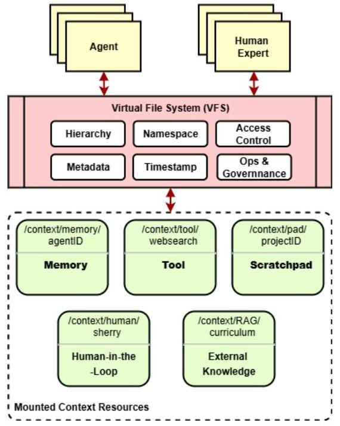
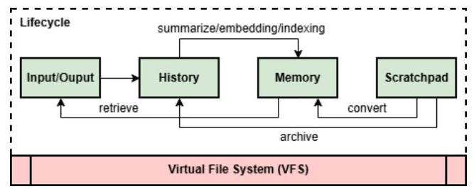
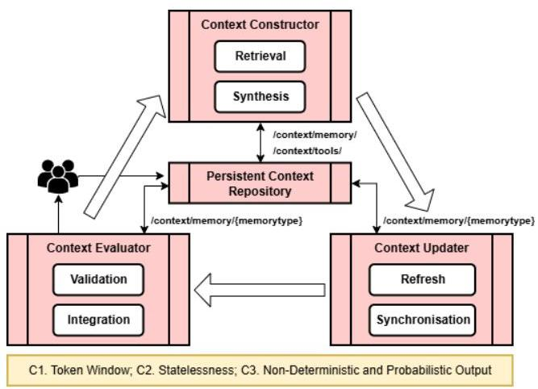

# Everything is Context: Agentic File System Abstraction for Context Engineering
[Paper](https://www.alphaxiv.org/abs/2512.05470)

## Summary
An agentic file-system abstraction unifies heterogeneous context sources for Generative AI, enabling a systematic and verifiable context engineering pipeline that addresses architectural constraints like limited token windows and statelessness. This approach, implemented in the AIGNE framework, fosters robust, traceable, and human-aligned GenAI systems.

*Figure 1: The proposed Virtual File System (VFS) architecture treats all context sources - memory, tools, human input, and external knowledge - as files within a unified hierarchy with consistent metadata, access control, and governance mechanisms.*

## Problem
* Generative AI (GenAI) context management is fragmented and ad-hoc, leading to transient, untraceable artifacts and "context rot."
* Foundation models face architectural constraints such as bounded token windows, statelessness, and non-deterministic outputs, requiring sophisticated context handling.
* The lack of a unified architectural abstraction hinders trustworthiness, verifiability, and the systematic integration of human judgment in GenAI systems.

## Method
* A novel "Agentic File System" (AFS) abstraction, inspired by Unix principles, treats all context sources (memory, tools, human input) as governed files.
* A layered "Persistent Context Repository" (History, Memory, Scratchpad) unifies context lifecycle management, providing traceability and addressing LLM statelessness.

*Figure 2: The persistent context repository manages the complete lifecycle of context through three layers: History (immutable logs), Memory (structured knowledge), and Scratchpad (temporary workspace).*
* A "Context Engineering Pipeline" (Constructor, Updater, Evaluator) systematically curates, delivers, and validates context within token window limits, incorporating human feedback.

*Figure 3: The three-component pipeline manages context under GenAI constraints: Constructor (retrieval/synthesis), Updater (refresh/synchronization), and Evaluator (validation/integration) with human-in-the-loop feedback.*

## Results
* Successfully implemented the AFS abstraction and context engineering pipeline within the open-source AIGNE framework, demonstrating practical operationalization for developer and industrial settings.
* Validated the approach with a memory-enabled agent that maintains persistent conversational coherence and user profiles across interactions.
* Demonstrated a GitHub assistant leveraging the Model Context Protocol (MCP) to mount external services as AFS modules, enabling agents to interact with complex tools via file-like operations.

## Takeaways
* Applying established software engineering principles transforms ad-hoc context engineering into a verifiable, modular, and scalable architectural discipline for GenAI.
* A unified file-system abstraction provides a consistent, governed environment, simplifying the integration and management of diverse, heterogeneous context elements.
* Explicitly tracking context provenance and incorporating human roles enhances trustworthiness, accountability, and enables continuous improvement of GenAI reasoning.