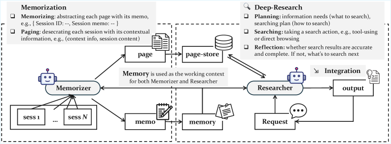
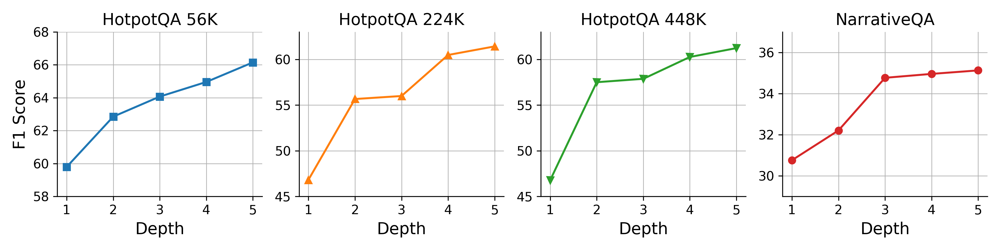
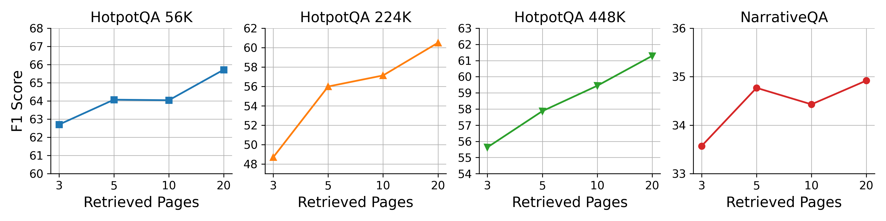

# General Agentic Memory Via Deep Research

[Paper](https://https://www.alphaxiv.org/abs/2511.18423v1) | [Article: GAM takes aim at “context rot”: A dual-agent memory architecture that outperforms long-context LLMs](https://venturebeat.com/ai/gam-takes-aim-at-context-rot-a-dual-agent-memory-architecture-that) 

## Summary
Researchers from BAAI, Peking University, Renmin University of China, and Hong Kong Polytechnic University developed General Agentic Memory (GAM), a framework for AI agents that employs a Just-in-Time Compilation principle through a dual-agent (Memorizer and Researcher) architecture. This approach, designed for dynamic context creation, consistently surpassed existing memory systems and achieved over 90% accuracy on complex multi-step reasoning benchmarks like HotpotQA.

## Problem
* Current AI agent memory systems, based on Ahead-of-Time (AOT) compilation, inevitably lose information during pre-computation and compression.
* These AOT systems possess static memory structures, limiting their adaptability to unforeseen or fine-grained information requests at runtime.
* Existing approaches often struggle with complex, multi-step information retrieval and reasoning across large or dispersed contexts, a problem exacerbated in basic RAG and long-context LLMs.

## Method

*Figure 1: The General Agentic Memory (GAM) framework operates through two phases: an offline Memorizer that processes sessions and builds a page-store while maintaining lightweight memory, and an online Researcher that performs deep research through iterative planning, searching, and reflection to answer client requests.*

* Introduces General Agentic Memory (GAM), a framework based on the "Just-in-Time (JIT) Compilation" principle that preserves complete historical data in a "page-store."
* Employs a dual-agent architecture: a Memorizer for offline processing to store full history and create light memory, and a Researcher for online, iterative "deep research."
* The Researcher dynamically constructs optimized contexts by planning, searching across a multi-tool toolkit (embedding, BM25, ID-based retrievers) over the page-store, and reflecting on integrated results.

## Results
* GAM consistently surpassed all baseline memory-free and state-of-the-art memory systems, exhibiting particular strength in complex, multi-step reasoning tasks where it achieved over 90% accuracy on HotpotQA and RULER multi-hop tracing.
* The system's performance scaled positively with increased reflection depth and number of retrieved pages, confirming its ability to benefit from dynamic test-time computation and the efficacy of using a multi-tool search approach.
* Ablation studies confirmed the indispensable roles of both the Memorizer's light memory in guiding search and the Researcher's deep-research capabilities for successful task completion, as removing either significantly degraded performance.

*Figure 2: Performance improvements with increasing reflection depth across different datasets, showing GAM's ability to benefit from additional test-time computation.*

*Figure 3: Performance gains from retrieving more pages during each research step, demonstrating the value of comprehensive information gathering.*

## Takeaways
* The Just-in-Time (JIT) compilation paradigm, which preserves full historical data and dynamically generates context, is effective in mitigating information loss observed in Ahead-of-Time (AOT) memory systems.
* Leveraging frontier LLMs for an iterative "Researcher" module, involving planning, multi-tool searching, and self-reflection, enables sophisticated, multi-step reasoning capabilities for AI agents.
* A lightweight, pre-computed memory serves a critical role in guiding the online deep research process, ensuring efficient and targeted retrieval from the comprehensive historical data.