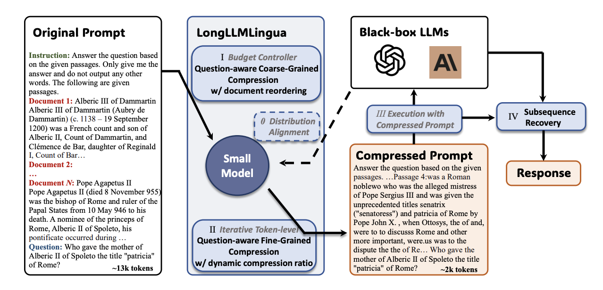
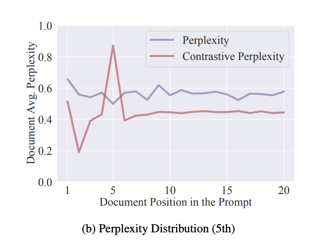

# LongLLMLingua: Prompt Compression for Long Contexts

[Paper](https://arxiv.org/abs/2310.06839) | [Code](https://github.com/microsoft/LLMLingua)

---

## Problem

Long prompts cause three issues:
1. Higher costs
2. Increased latency
3. Performance degradation

The core insight from research: LLM performance depends on the density and position of key information in the prompt. When prompts get long, key info gets buried and performance drops.

This directly connects to context rot findings - as context grows, models struggle to find relevant info, especially when it's in the middle.

---

## What LongLLMLingua Does

Compresses prompts while improving LLMs' perception of key information.

The approach: don't just compress randomly. Compress based on what's relevant to the question, and reorganize so key info is easier to find.

**Results:**
- NaturalQuestions: 21.4% performance boost using ~4x fewer tokens
- LongBench: 94.0% cost reduction
- 1.4x-2.6x latency speedup when compressing 10k token prompts

Compressed prompts often outperform original uncompressed prompts.

---

## How It Works



LongLLMLingua has four key mechanisms:

### 1. Question-Aware Coarse-Grained Compression

Instead of treating all documents equally, scores each document's relevance to the question.

Uses a small LM to calculate: how likely is the question given this document?

Formula: `p(question | document)` 

This is different from embedding-based retrieval. It uses conditional perplexity to measure association between question and document.

The paper shows this achieves highest recall compared to BM25, OpenAI embeddings, Sentence-BERT, and reranker methods.

### 2. Question-Aware Fine-Grained Compression

At the token level, uses "contrastive perplexity" - the distribution shift caused by conditioning on the question.

```
contrastive_perplexity(token) = 
  perplexity(token | context) - perplexity(token | question, context)
```

This is mathematically equivalent to conditional pointwise mutual information.

Tokens with high contrastive perplexity cluster near ground-truth documents. Tokens unrelated to the question have low contrastive perplexity even if they have high information content.



### 3. Document Reordering

Addresses "lost in the middle" directly.

After scoring documents by relevance, reorders them to put most relevant ones at start and end of context (where models pay most attention).

This works even for timeline-related tasks - reordering doesn't hurt understanding, it just makes key info more accessible.

### 4. Dynamic Compression Ratios

Not all parts of a prompt need same compression:
- Question: 0% compression (keep everything)
- Highly relevant documents: light compression
- Low-relevance documents: aggressive compression

Uses importance scores from coarse-grained compression to dynamically allocate compression budgets.

### 5. Subsequence Recovery

LLMs often replicate entities from prompts (names, places, organizations). Compressing these at token level doesn't affect semantic understanding but can cause errors in generated content.

Solution: after generation, restore original entities by matching subsequences between compressed prompt and LLM response.

Example:
- Compressed: "Wilhelmgen"
- After recovery: "Wilhelm Conrad Röntgen"

---

## Results

### Performance Gains

**NaturalQuestions (multi-doc QA):**
- 2x compression: 77.2% accuracy vs 75.7% original
- 4x compression: 75.0% accuracy vs 54.1% original (ground truth at 10th position)
- Up to 21.4% improvement with 4x fewer tokens

**LongBench (general long context):**
- 2k token constraint: 48.3% avg vs 44.0% original
- Works across single-doc QA, multi-doc QA, summarization, few-shot, synthetic, code

**Key finding:** Compression doesn't hurt performance - it helps by making key info more salient and removing noise.

### Cost & Latency

- 71.7% cost reduction on Multi-doc QA
- 90.5% cost reduction on LongBench  
- 94.0% cost reduction on LooGLE benchmark
- 1.4x-2.6x latency speedup (2x-6x compression ratios)

### Comparison to Baselines

**vs Retrieval methods (BM25, SBERT, OpenAI):**
- Work well at low compression but degrade as compression increases
- LongLLMLingua more robust across different compression ratios

**vs Compression methods (Selective-Context, LLMLingua):**
- These fail to consider question during compression
- Include too much noise, sometimes worse than zero-shot
- LongLLMLingua's question-aware approach maintains or improves performance

---

## Why This Matters for Your Research

### Directly Addresses Context Rot

Your Context Rot research shows:
- Performance degrades as input length increases
- Semantic similarity between question and answer matters
- "Lost in the middle" is a real problem

LongLLMLingua tackles all three:
- Reduces context length while preserving signal
- Keeps semantically relevant tokens
- Repositions key info to avoid middle positions

### Alternative to Your Compaction Strategies

From your docs: "overly aggressive compression leads to information loss."

LongLLMLingua's approach: compress the noise, preserve the signal. It's selective rather than indiscriminate.

Different from:
- Keep last N turns: doesn't consider semantic relevance
- Token-based truncation: arbitrary cutoff
- Recursive summarization: loses details through repeated compression

LongLLMLingua is more like "intelligent pruning" - removes redundancy while preserving structure.

### Complements ACE

ACE grows context through delta updates. LongLLMLingua shrinks context through smart compression.

Both avoid "rewrite everything and lose details" problem. ACE accumulates knowledge, LongLLMLingua distills it.

Could combine: use ACE to build context over time, use LongLLMLingua when context exceeds window limits.

### Relevant to Your Memory Architecture

From your Sessions & Memory doc: sessions grow over time, need strategies to manage long contexts.

LongLLMLingua offers different approach than memory extraction:
- Memory systems: extract and store key facts
- LongLLMLingua: compress entire context while preserving queryability

Both preserve "restorability" - your principle of keeping content restorable (URLs, file paths). LongLLMLingua's subsequence recovery aligns with this.

---

## Practical Implementation

**When to use:**
- Long document analysis (10k+ tokens)
- Multi-document QA
- RAG systems with many retrieved chunks
- Any scenario where you have more context than fits comfortably in window

**When not to use:**
- Short prompts (overhead not worth it)
- Tasks where every token matters (legal docs)
- When you need human-readable prompts

**Integration:**
Already in LangChain and LlamaIndex for RAG workflows.

Uses small LM (LLaMA-2-7B) for compression scoring. Target LLM (GPT-4, Claude, etc) only sees compressed result.

---

## Limitations

From the paper:

1. **Question-aware = no caching:** Must recompress for different questions even with same context. Can't cache compressed context across queries.

2. **Computational overhead:** 2x the compute of LLMLingua due to question-aware scoring. Mitigated by using task-aware compression for reusability.

3. **Complex relationships:** Effectiveness might decrease when context-prompt relationships are subtle or require multi-hop reasoning.

---

## Open Questions for Your Research

- How does this interact with your "file system as context" approach?
- Could you combine LongLLMLingua with memory-as-a-tool? Use compression for session management, memory for cross-session persistence?
- Your docs mention kv-cache optimization - LongLLMLingua's compressed prompts would have higher cache hit rates since they're shorter and more stable
- Does question-aware compression align with how your memory manager decides what to extract?

---

## Key Figures to Include

1. **Performance vs Document Number** (Figure 1a in paper): Shows how performance degrades with more documents
2. **Performance vs Position** (Figure 1b): Demonstrates "lost in the middle" and how reordering helps
3. **Framework Diagram** (Figure 2): Overview of entire system
4. **Recall Distribution** (Figure 3a): Comparison with retrieval methods
5. **Perplexity Distribution** (Figure 3b): Contrastive vs regular perplexity