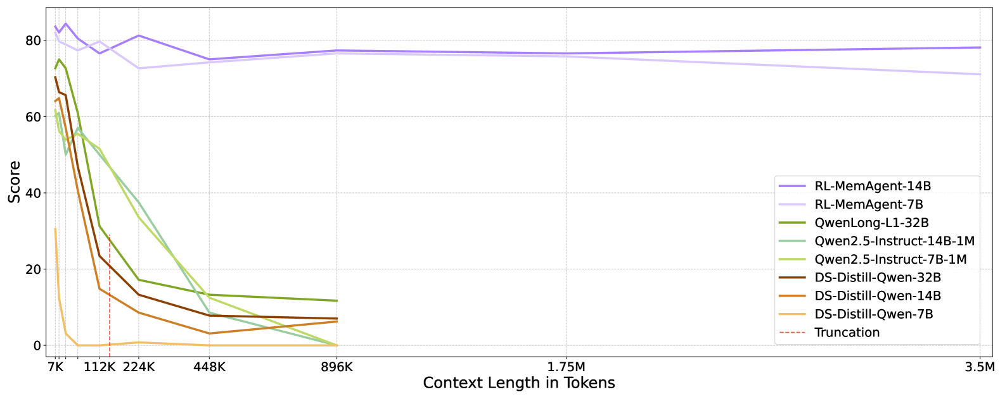

# MemAgent

[Paper](https://www.alphaxiv.org/abs/2507.02259)

## Summary
MemAgent allows large language models to process arbitrarily long input texts by training an internal, fixed-length memory agent with reinforcement learning. This method enables LLMs, such as Qwen models trained on 32K tokens, to extrapolate to contexts up to 3.5 million tokens on QA tasks with less than 5% performance degradation, while maintaining linear computational complexity. The work was a collaboration between ByteDance Seed and Tsinghua University's Institute for AI Industry Research.

*Figure 1: MemAgent demonstrates exceptional performance across varying context lengths, maintaining over 75% accuracy even at 3.5 million tokens while baseline models experience severe degradation.*

## Problem
* Large Language Models are limited by fixed context windows, preventing them from effectively processing extremely long texts.
* Current methods for extending context often incur significant computational costs (O(N^2)) or suffer performance degradation at longer lengths.
* Real-world applications like processing entire books or maintaining long-term agent memory are impractical due to these limitations.

## Method
* A fixed-length, dynamically updated internal "memory" is integrated into the LLM's context window as ordinary tokens.
* An "overwrite strategy" processes long documents segment-by-segment, maintaining a constant memory size to achieve linear O(N) computational complexity.
* Reinforcement Learning, using an adapted Multi-Conv DAPO algorithm, trains the LLM to selectively update and manage this memory.

## Results
* RL-MemAgent models, trained with an 8K context window, extrapolated to 3.5 million tokens on QA tasks while maintaining over 71% accuracy with less than 5% performance loss.
* The approach significantly outperforms existing long-context LLMs, which experienced substantial performance degradation or complete failure beyond 112K tokens.
* MemAgent exhibits strong generalization across diverse out-of-distribution RULER benchmark tasks, achieving over 95% accuracy on average for the 14B model up to 512K tokens.

## Takeaways
* Drawing inspiration from human cognitive processes, an LLM can be taught to selectively abstract and retain relevant information from long documents.
* The task of memory management within an LLM (deciding what information to keep or discard) can be effectively formulated and optimized as a reinforcement learning problem.
* An adaptation of the DAPO algorithm, called Multi-Conv DAPO, enables training the memory agent across multiple context-independent memory update steps that lead to a final outcome.